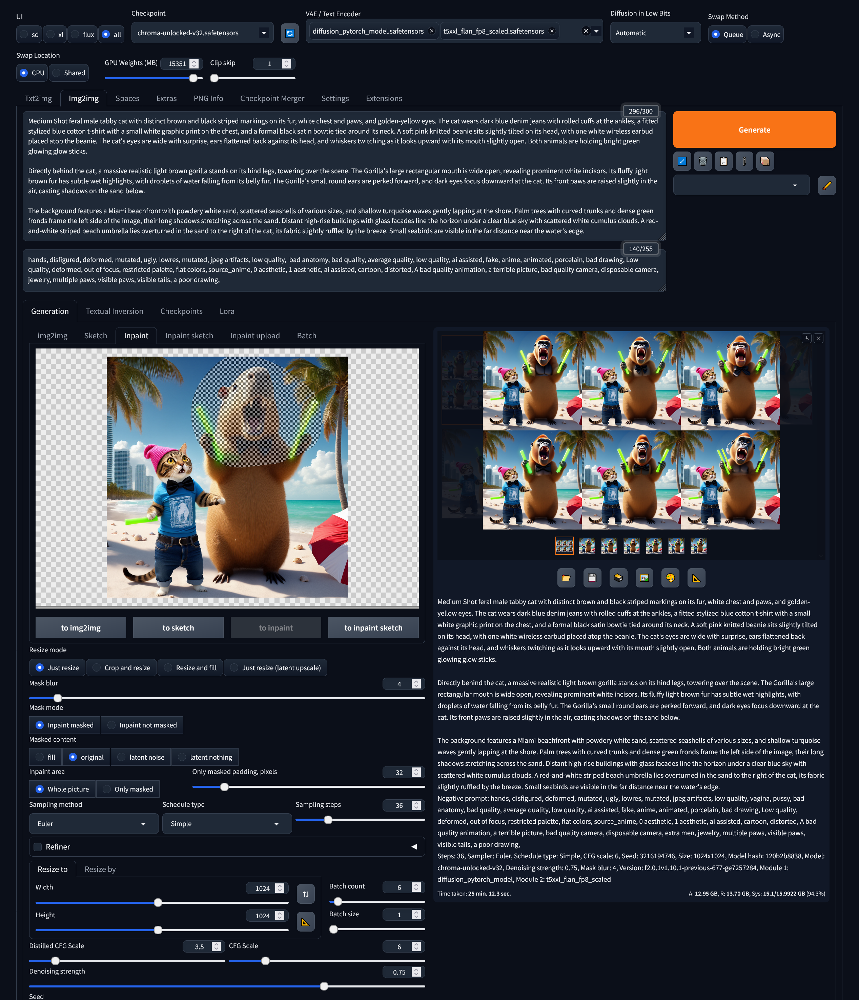

## Fork of forge to use Chroma!

This is a fork with the patch from https://github.com/croquelois/forgeChroma preinstalled thanks Thanks to [@croquelois](https://github.com/croquelois) && [@lllyasviel](https://github.com/lllyasviel)!   
I am going to keep updating it with new features. Suggestions are welcome.  

To use:  
Download one of the t5xxl text encoders from https://huggingface.co/silveroxides/t5xxl_flan_enc and place in models/text_encoder.  
Download the vae from https://huggingface.co/black-forest-labs/FLUX.1-schnell/tree/main/vae and put it in models/vae.  
Download a checkpoint from https://huggingface.co/lodestones/Chroma/tree/main ie chroma-unlocked-v29.5.safetensors and place in models/Stable-diffusion.  

run webui-user.bat or install manually for linux.  
After you first run webui-user.bat it might error, if so, close it and re run it.  

in Forge, on the top left select all and not flux  
select the checkpoint and then in the next field select the text encoder and vae.  
Use euler simple scheduler.  
set the distilled config scale to 1, and the normal config scale to something like 3.5  
use a very long positive prompt and a very long negative prompt.  
forge doesn't seem to work with all quantized model, Q4_K_S fail, but Q4_1 work  

To update to torch 2.7.0 with cuda 12.8 on windows, navigate to your home directory ie c:/chromaforge and run these commands:
venv/scripts/activate  
 pip install torch==2.7.0+cu128 torchvision==0.22.0+cu128 --index-url https://download.pytorch.org/whl/cu128  

## Changlog  

5/25/2025  
    Add support for sage and flash attention from this pr: https://github.com/lllyasviel/stable-diffusion-webui-forge/pull/2881  from @spawner1145  
    use the methods by adding --use-sage-attention or --use-flash-attention  ... upon testing by a few people does not seem to have an increase on speed at all.  
5/18/2025  
    Update to latest version of forge. Fix broken queuing.  

    