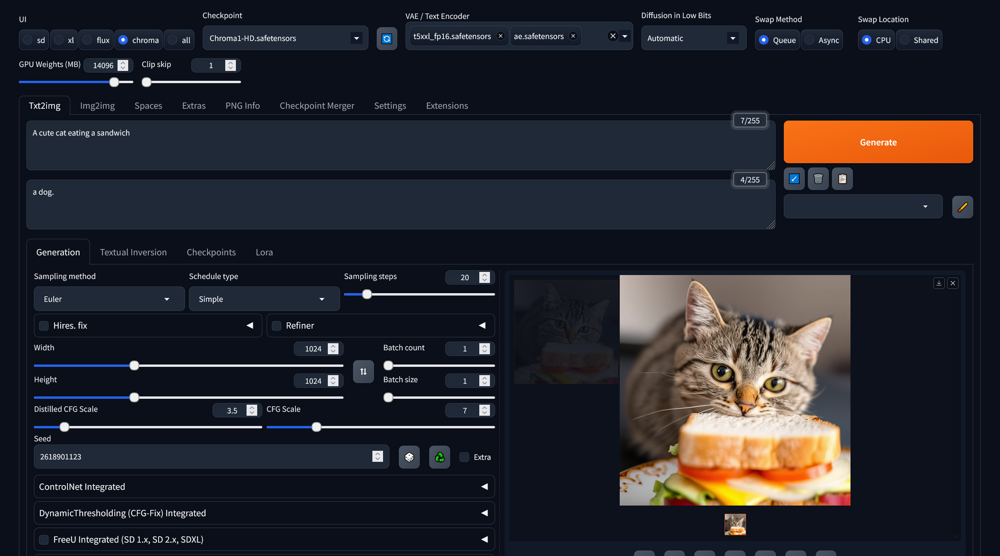

## Fork of forge to use Chroma!

This is a fork with the patch from https://github.com/croquelois/forgeChroma preinstalled thanks Thanks to [@croquelois](https://github.com/croquelois) && [@lllyasviel](https://github.com/lllyasviel)!   
I am going to keep updating it with new features. Suggestions are welcome.  

To use:  
git clone https://github.com/maybleMyers/chromaforge  
Download one of the t5xxl text encoder from https://huggingface.co/flux-safetensors/flux-safetensors/blob/main/t5xxl_fp16.safetensors and place in models/text_encoder.  
Download the vae from https://huggingface.co/lodestones/Chroma/tree/main ae.safetenstors and put it in models/vae.  
Download the main chroma model from https://huggingface.co/lodestones/Chroma1-HD/blob/main/Chroma1-HD.safetensors  

You will need python3.10 installed.  
Run webui-user.bat for windows installation.  Run webui.sh for linux installation (./webui.sh) from the chromaforge root directory.  
After you first run webui-user.bat it might error, if so, close it and re run it.  
To update to the latest version navigate to your root directory in a terminal and type "git pull"  

in Forge, on the top left select chroma    
select the checkpoint and then in the next field select the text encoder and vae.  
Use euler simple scheduler to start.  
set the CFG scale to something like 3.5-7  
forge doesn't seem to work with all quantized model, Q4_K_S fail, but Q4_1 work  
refer to screenshot for working settings.  

there's a bunch of extra samplers/schedulers at these places:  
https://github.com/DenOfEquity/webUI_ExtraSchedulers
https://github.com/MisterChief95/sd-forge-extra-samplers

## To use the Z-Image model

Download the files from here https://huggingface.co/maybleMyers/z-image. put the text encoder in the text encoder folder, vae in vae folder and transformer in the stable diffusion folder. Select z in the top by the ui. It might work with other safetensors I have not tested them.  

## Radiance Model

Download a checkpoint from here https://huggingface.co/lodestones/chroma-debug-development-only/tree/main/radiance then convert it with convertpth.py. Put it in your stable diffusion subfolder. Use the radiance model in the chroma tab of the gui without a vae. It will be automatically detected. Use the same T5 you normally use.  
The memory management is currently derped. It will run fast with a 24GB card when setting the gpu weights to about 19,200, but if you need to offload expect 2x slowdown. You can dick with the gpu weights setting and it might run good if you set it to like half your vram or 3/4, I am working on improving the speeds with it.   

Training: https://github.com/lodestone-rock/flow/  https://github.com/kohya-ss/sd-scripts/tree/sd3  
Donate to Lodestone (training is bookoo expensive and crowdfunded): https://ko-fi.com/lodestonerock  
Discord for help etc. https://discord.gg/wDaEfNGuCX  

## Changlog
12/2/2025  
    Support the controlnet model. On the controlnet branch for now. switch to the controlnet branch to use it and put https://huggingface.co/alibaba-pai/Z-Image-Turbo-Fun-Controlnet-Union/blob/main/Z-Image-Turbo-Fun-Controlnet-Union.safetensors in the controlnet folder in the models dir.  
11/29/2025  
    Support loras in z-image.  
11/27/2025  
    Add support for z-image model.   
10/25/2025  
    Support auraflow in the p7 branch. To switch branches just navigate to your root directory then type "git switch p7" for example.  
10/15/2025  
    Upgrade default torch version to 2.7.1 to support 50xx series gpu.  
9/29/2025  
    Implement diffusers style T5 embedding mask as seen here: https://github.com/huggingface/diffusers/pull/12263 seems to help alot with details.  
9/26/2025  
    Improve memory management when offloading with async. async should be the fastest way to offload. Offloading with radiance improved, still slow though.   
9/24/2025  
    One trainer lora should load correctly now.  
9/2/2025  
    Add res 2s, res 6s and res 16s samplers to main. Thanks to ClownsharkBatwing https://github.com/ClownsharkBatwing/RES4LYF  
8/29/2025  
    Fixed previews w/ radiance chroma models, fixed memory management and offloading mechanisms for radiance somewhat, the memory management deffinately needs some more work.  
8/28/2025  
    Added initial support for the radiance model class.  
7/13/2025  
    Increase max res for chroma to 3072, add dedicated chroma button.  
6/11/2025  
    Add links, Sigmoid Offset scheduler (thanks to croq and silveroxides https://github.com/silveroxides/ComfyUI_SigmoidOffsetScheduler), fix euler a simple sampler via croq's PR in forge https://github.com/lllyasviel/stable-diffusion-webui-forge/pull/2915.  
5/27/2025  
    Fixed the sage attention implementation to work with chroma.  
5/25/2025  
    Add support for sage and flash attention from this pr: https://github.com/lllyasviel/stable-diffusion-webui-forge/pull/2881  from @spawner1145  
    use the methods by adding --use-sage-attention or --use-flash-attention  ... upon testing by a few people does not seem to have an increase on speed at all.  
5/18/2025  
    Update to latest version of forge. Fix broken queuing.  
